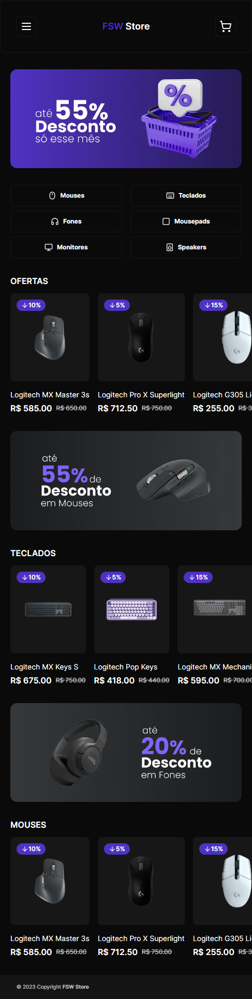

<h1 align="center">FSW Store</h1>

<p align="center">
  
</p>

<br>

<p align="center">
  
</p>

## 💻 Projeto

Aplicação de um E-commerce de eletrônicos.

## 🧪 Tecnologias

Esse projeto foi desenvolvido com as seguintes tecnologias:

- [Next.js](https://nextjs.org/)
- [TypeScript](https://www.typescriptlang.org/)
- [Tailwind CSS](https://tailwindcss.com/)
- [Prisma](https://www.prisma.io/)
- [Stripe](https://stripe.com/)
- [Shadcn](https://ui.shadcn.com/)

## 🚀 Como executar

```bash
# Clone este repositório
$ git clone https://github.com/jhonathanalencar/fsw-store.git

# Entre na pasta
$ cd fsw-store

# Instale as dependências
$ npm install

# Copie e preencha as variáveis de ambiente do arquivo .env.example em um arquivo .env

# Execute a aplicação em modo de desenvolvimento
$ npm run dev

# A aplicação inciará na porta:3000
acesse <http://localhost:3000>
```

## 📝 Licença

Esse projeto está sob a licença MIT. Veja o arquivo [LICENSE](LICENSE) para mais detalhes.

---

<p align="center">
  
</p>
